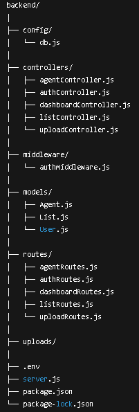
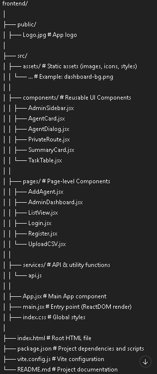
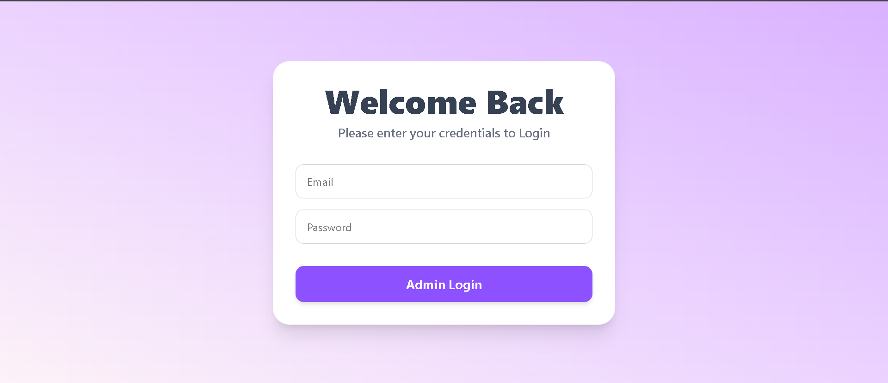
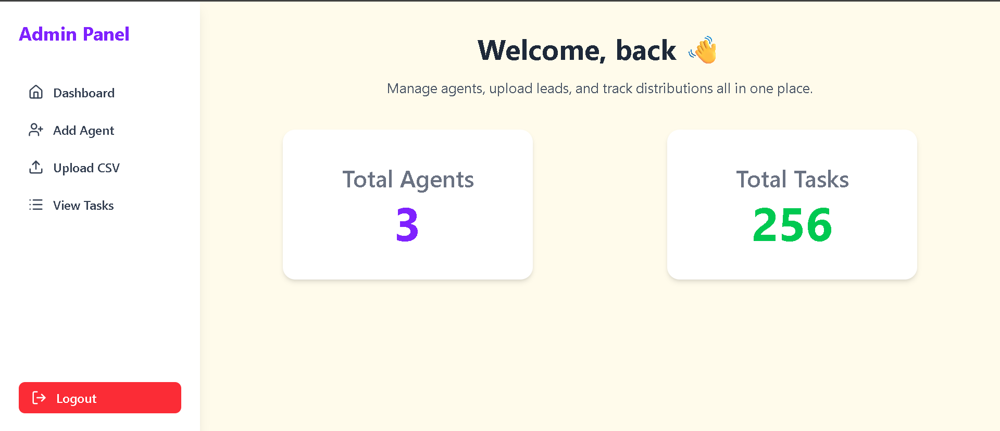
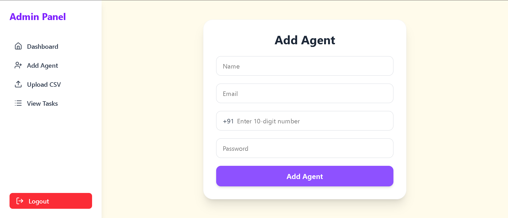
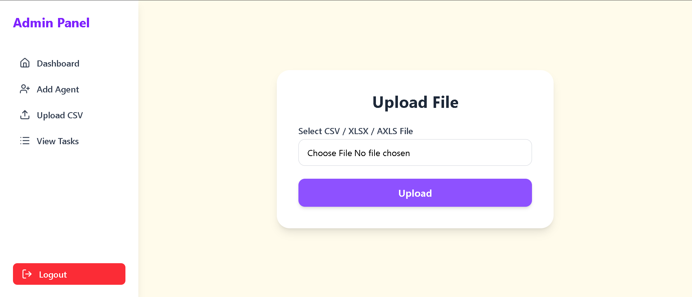
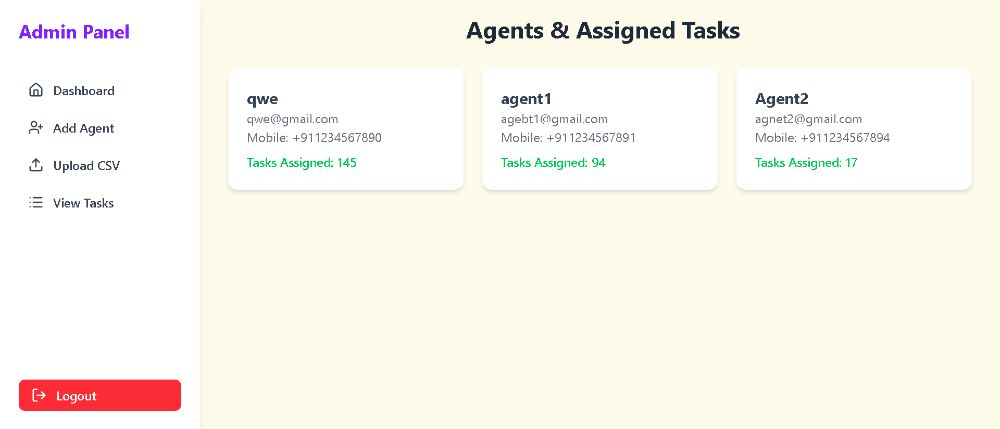
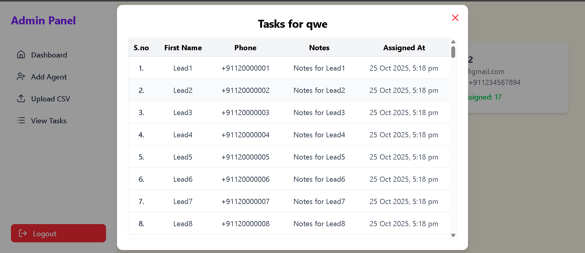

# 🧠 MERN Admin Dashboard

This is an **Admin Dashboard** built using the **MERN stack (MongoDB, Express, React, Node.js)**.  
It allows the admin to manage agents, upload CSV files, and automatically distribute tasks among agents.

---

## 🏗️ Tech Stack

- ⚛️ React 18

- ⚡ Vite

- 💅 CSS / Tailwind (optional)

- 🌐 Axios

- 🔒 JWT Authentication

---

## 📁 Project Structure

### 🧩 Backend Structure



### 🎨 Frontend Structure



---

## ⚙️ Environment Variables

### 🔙 Backend (.env)
```bash
PORT=3000
MONGO_URI=your_mongodb_connection_string
JWT_SECRET=your_secret_key
ADMIN_SECRET_KEY=your_admin_secret_key
```

---
## 🚀 Setup & Installation
### 1️⃣ Clone the Repository
```bash
git clone https://github.com/yourusername/mern-admin-dashboard.git
cd mern-admin-dashboard
```

### 2️⃣ Install Dependencies
```bash
Backend:

cd backend
npm install
```

```bash
Frontend:

cd frontend
npm install
```
### 3️⃣ Update package.json (scripts section)
```bash
Open package.json and add:

"scripts": {
  "start": "node server.js",
  "dev": "nodemon server.js"
}
```

###  4️⃣ Run the Application
```bash
Start Backend: 

cd backend
npm run dev
```

```bash
Start Frontend:

cd frontend
npm run dev
```
---

### Add Admin
---
```bash
Step 1: Open Postman or any other
        Create a new request and select the POST method.


Step 2: Enter the API Endpoint
        Example: http://localhost:3000/api/admin/registerAdmin


Step 3: Set the Request Method to POST.


Step 4: Add Authorization Header

        In the Authorization tab, add the following:

        KEY	              VALUE
        Authorization	  yourSecretKey123

        ⚠️ Make sure this key matches your .env file:

        ADMIN_SECRET_KEY=yourSecretKey123


Step 5: Add Request Body

        Go to the Body tab → select raw → choose JSON format,
        then enter the following sample data:

        {
          "name": "Admin User",
          "email": "admin@example.com",
          "password": "Admin@123"
        }


🔹 Step 6: Send the Request
```

### 📤 Upload & Distribution Flow
---

```bash
1. Admin logs in.

2. Uploads a .csv file containing columns: FirstName, Phone, Notes

3. The backend automatically distributes entries evenly among all agents.

4. Each agent’s totalTasks count updates accordingly.
```

### 🔐 Authentication

```bash
Admin & Agent login is JWT-based.

Protected routes check tokens using middleware (authMiddleware.js).

Tokens are stored in sessionStorage on the frontend.
```
---

### 🧠 Key Features
---

    ✅ Admin Login / Logout

    ✅ Add Agents

    ✅ Upload CSV & auto-distribute tasks

    ✅ Token-based Authentication

    ✅ Task summary dashboard

    ✅ Error handling & form validation 


---

### 🖼️ Screenshots
---
**Admin Login Page**



**Admin Dashboard**



**Add Agent**



**Upload File**



**View Agents**



**Task List**



---

### 👨‍💻 Author
---

Vaibhav Kumar

GitHub -